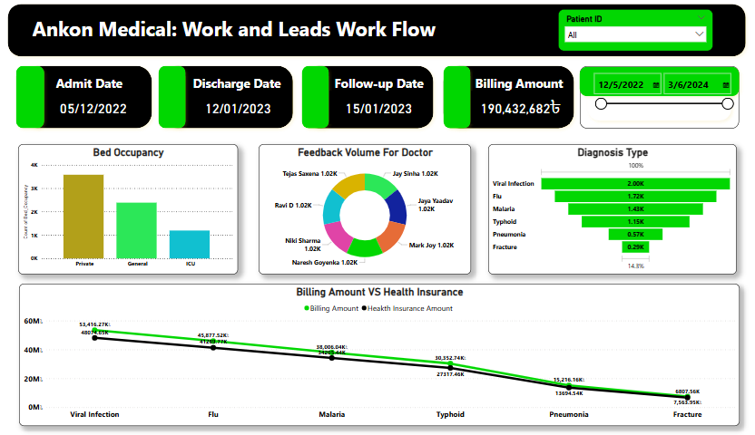

# Medical Dashboard

## Overview
This is a Medical Dashboard designed to visualize and analyze medical data. It provides insights into key patient-related factors such as **Patient Admit Date**, **Discharge Date**, **Follow-up Date**, and **Billing Amount**. Various types of visualizations, including **Bar Charts**, **Donut Charts**, **Time Series**, and **Funnel Charts**, are used to represent the data effectively. The dashboard also includes dynamic filtering options for a more interactive user experience.

## Features
- **Key Visualizations**:
  - **Bar Chart**: Displays the total number of patients and their billing amounts.
  - **Donut Chart**: Shows the percentage breakdown of patient categories.
  - **Time Series**: Tracks patient admit and discharge dates over time.
  - **Funnel Chart**: Illustrates the patient journey from admit to discharge to follow-up.
  
- **Dynamic Filters**:
  - **Patient ID Slicer**: Allows users to filter data based on individual patient IDs and view specific patient details.
  - **Date Range Slicer**: Filters data based on a selected date range, providing flexibility in analyzing medical records over time.

